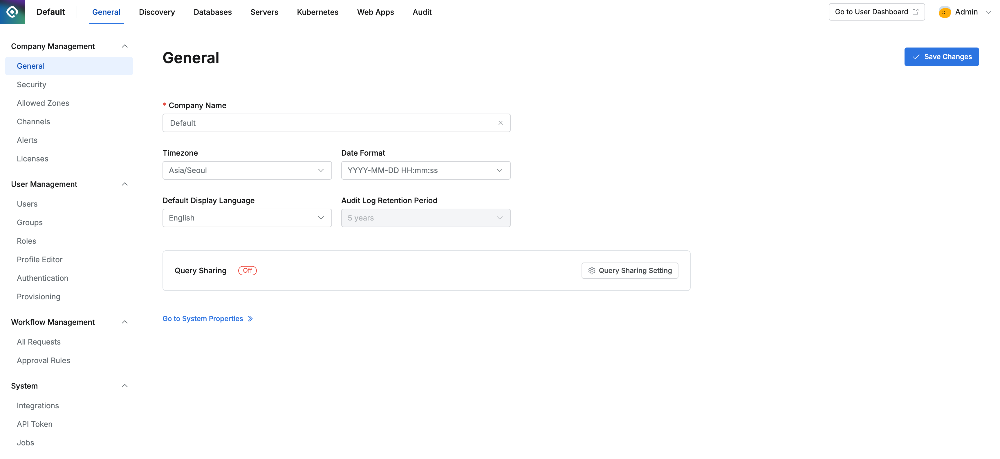
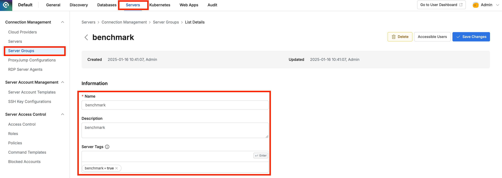
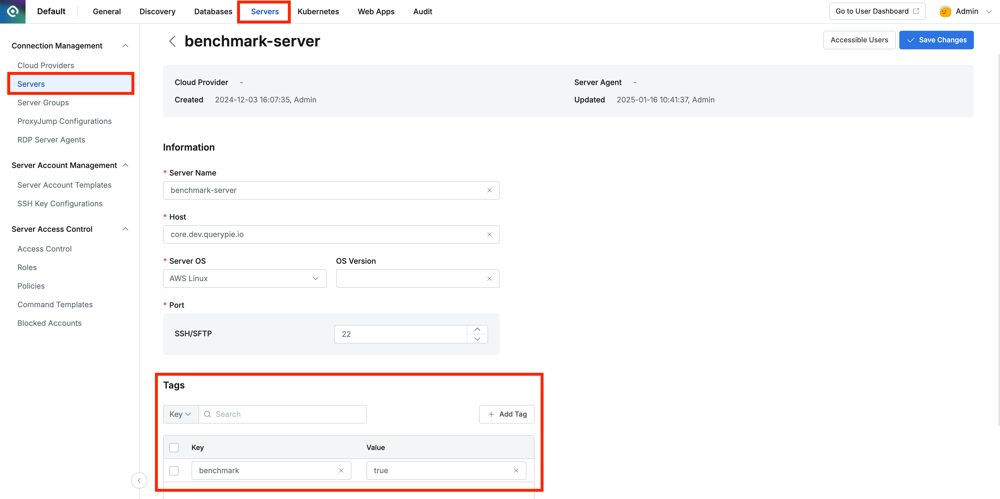
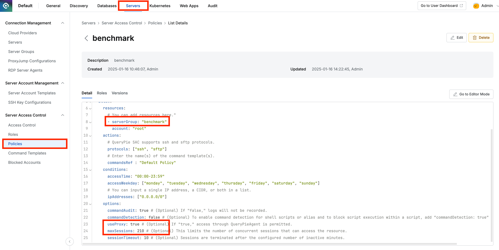
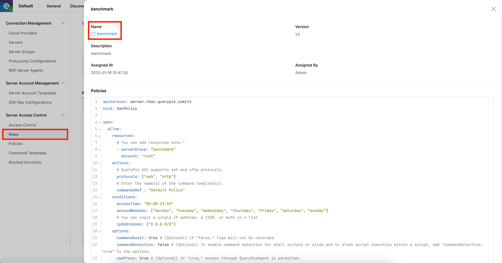
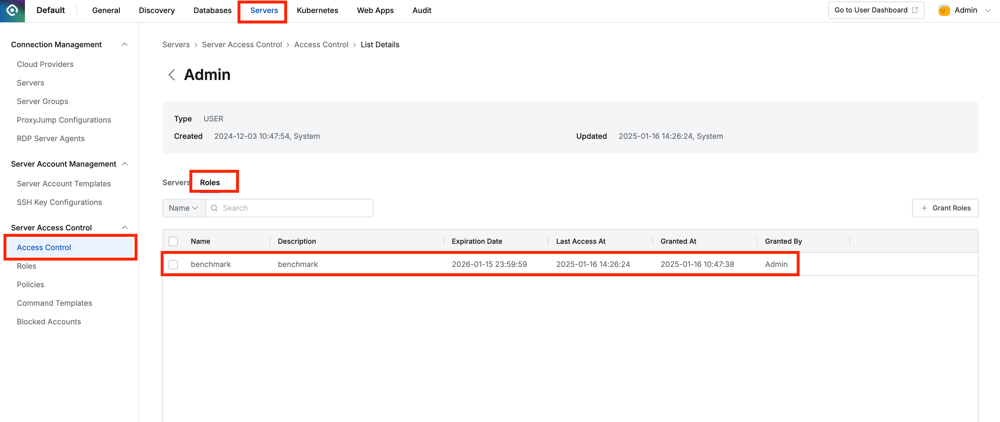
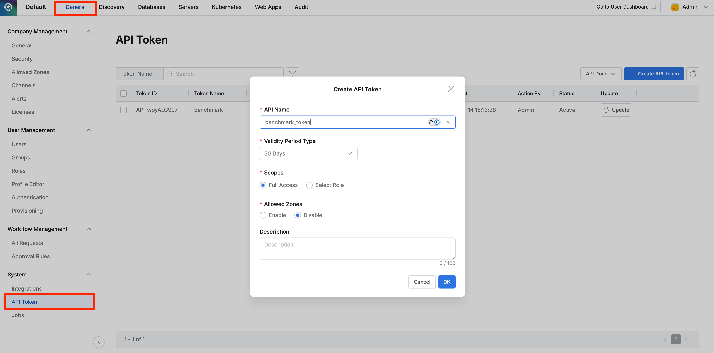
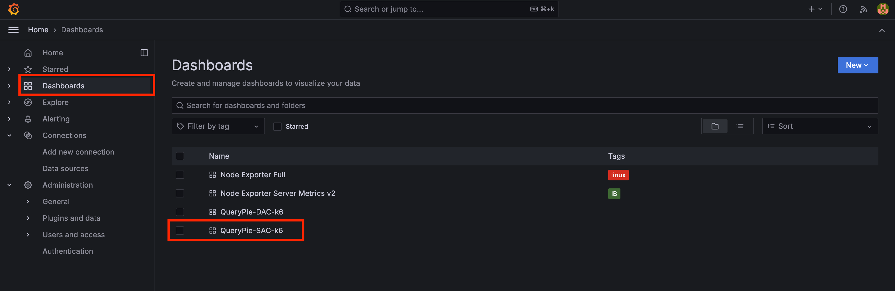
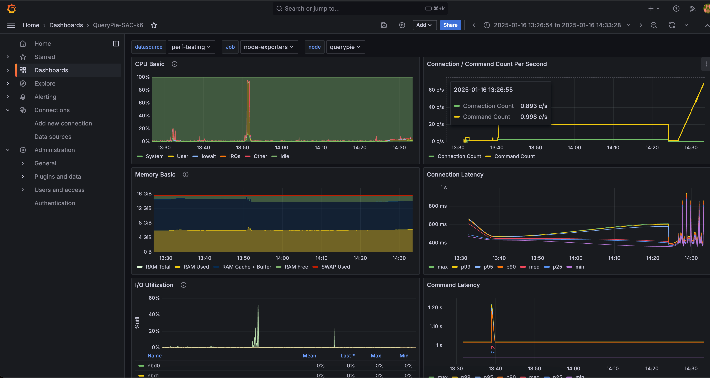

# 성능테스트 환경구성 안내

QueryPie 제품에 대한 성능테스트를 수행하기 위한 환경을 구성하는 방법을 안내합니다.

## 클라우드 인프라 구성 가이드

VM 생성, 네트워크, 보안 그룹 등 클라우드 인프라 구성이 필요한 경우 아래 가이드를 먼저 참고하세요.
각 가이드는 **콘솔(웹 UI)** 방법과 **CLI** 방법을 함께 제공합니다.

| 클라우드 | 가이드 문서 |
|---------|-----------|
| AWS | [docs/aws.ko.md](docs/aws.ko.md) |

---

# 성능테스트를 위한 소프트웨어 구성 예시

3대의 VM 에 QueryPie, MySQL, Grafana K6 등을 설치하여 성능테스트를 수행합니다.
각 VM 에 설치하고 실행하는 세부 요소는 다음과 같습니다.

- VM #1
    - QueryPie Server : 테스트 대상
    - prometheus/node_exporter
- VM #2
    - MySQL Server : QueryPie 의 Meta DB, Log DB 를 담당
    - Redis Server : QueryPie 의 Redis cache 를 담당
    - prometheus/node_exporter
- VM #3
    - Grafana : Metric 시각화
    - Prometheus Server
    - prometheus/node_exporter

# 준비할 사항

QueryPie Server, MySQL, Redis 를 설치하고 실행합니다.
이 가운데, 시스템 자원을 주로 사용하는 두가지 소프트웨어, QueryPie Server 와 MySQL 을 서로 다른 VM 에
설치하여 시스템 이용 지표를 측정하는 것을 권장합니다.

Redis 의 시스템 이용 지표를 상세하게 살펴보려는 경우, 다른 리눅스 시스템에 분리하여 설치할 수 있습니다.

# 성능 테스트 소프트웨어 설치방법

두 가지 방법이 있습니다. 첫번째 방법, git repository 를 clone 하는 방법을 권장합니다.

- 설치방법1 : perf-testing git repository 를 각 시스템에 git clone 하여 사용합니다.
    1. 환경을 구성할 리눅스 서버에 terminal 로 접속합니다.
    2. 계정의 홈디렉토리 또는 작업용 디렉토리에서 git clone 명령을 수행합니다.
        - `git clone https://github.com/chequer-io/perf-testing.git`
    3. 하위 디렉토리에 생성된 node-exporter 등 디렉토리에서 docker-compose 명령으로 container 를 실행합니다.

- 설치방법2 : perf-testing.zip 파일을 내려 받아, 각 시스템에 복사하여 옮기고, 압축을 해제합니다.
    1. [perf-testing-develop.zip](https://github.com/chequer-io/perf-testing/archive/refs/heads/develop.zip) 을 내려받습니다.
    2. perf-testing-zip.zip 파일을 테스트 대상 서버에 복사하여 옮기고, 압축을 해제합니다.
        - tar xvf perf-testing-develop.zip

## Node Exporter

리눅스 시스템의 CPU, Memory, Disk IO, Network IO 이용량 지표를 수집하기 위해, 각 VM 에 모두 설치합니다.
docker-compose.yml 을 변경하지 않아도 됩니다. 별도의 설정파일이 필요하지 않습니다.

- 실행하기
    - cd node-exporter
    - docker-compose up --detach
- 종료하기
    - cd node-exporter
    - docker-compose down

## Prometheus Server

Node Exporter 를 통해 리눅스 시스템의 이용량 지표를 수집하고,
Grafana-K6 성능 테스트 프로그램의 작동 지표를 저장하는 API 를 제공합니다. 모든 지표는 Prometheus server 의
시계열 데이터베이스(Time Series Database)에 저장됩니다. Grafana dashboard 는 Prometheus 에 저장된
데이터를 Dashboard, Chart 로 시각화합니다.

Prometheus Server 가 올바르게 작동하기 위해서는, 제공되는 prometheus.yml 설정파일을 적절히 편집하여야 합니다.
설정파일을 변경할 부분은, Node Exporter 가 작동하는 리눅스 시스템의 IP Address 를 적절히 지정하는 것입니다.
지표를 수집해야 하는 대상 리눅스 시스템의 수가 3개가 아닌 경우, 그에 맞추어 대상을 추가하거나 삭제할 수 있습니다.

Prometheus 의 Management API 를 이용해, 실행상태를 검사하고, 재시작할 수 있습니다. `prometheus.yml`을
변경한 후, docker-compose down, docker-compose up 을 수행하지 않고, 재시작 API 를 호출하는 것을
권장합니다. docker-compose down 을 수행하는 경우, 일시적으로 지표 데이터 수집이 멈추게 되어, 지표 데이터를
부분적으로 잃어버리게 됩니다. 재시작 API 를 호출하는 경우, Server Process 를 짧은 시간에 재시작하여,
지표 데이터 유실을 최소화하는 동시에, 변경된 설정을 반영하게 됩니다.
[Management API Reference](https://prometheus.io/docs/prometheus/latest/management_api/)
를 참고하세요.

- 설정하기
  - cd prometheus
  - vi etc/prometheus/prometheus.yml
- 실행하기
    - cd prometheus
    - docker-compose up --detach
- 종료하기
    - cd prometheus
    - docker-compose down
- 실행상태 검사하기
    - `curl http://localhost:9090/-/ready`
- 설정파일 변경 후, container 를 유지한 상태에서, Prometheus server process 를 재시작하기
    - `curl -X POST http://localhost:9090/-/reload`

## Grafana

Prometheus 가 수집한 지표를 Dashboard 형태로 시각화하는 웹서비스를 제공합니다.
기본 제공되는 설정파일을 변경하지 않고, 곧바로 docker container 를 실행하여 사용할 수 있습니다.

처음 설치하여 실행하는 경우, [grafana.ini](grafana/etc/grafana/grafana.ini) 파일에 설정된 admin 계정의
Username, password 를 이용해 접속합니다. 허락되지 않은 이용자의 접근을 차단하기 위해, 처음 접속 후,
새로운 계정을 생성하거나, admin 계정의 비밀번호를 변경하여 사용하는 것을 권장합니다.

빠른 설정을 위해, Prometheus Data Source 설정을 기본으로 제공합니다. 추가적인 설정 없이, 곧바로 데이터를
조회할 수 있습니다.

3가지 Dashboard 설정을 기본으로 제공합니다.
- querypie-dac-k6 는 성능테스트 결과를 살펴보기 위해 구성한 Dashboard 입니다.
- node-exporter-server-metrics-v2, node-exporter-full 은 리눅스 시스템의 자원 이용 지표를
  살펴보기에 편리한 Dashboard 이며, Grafana Labs 에서 제공되는 공개된 Dashboard 를 옮겨온 것입니다.

- 실행하기
  - cd grafana
  - docker-compose up --detach
- 종료하기
  - cd grafana
  - docker-compose down

## Grafana K6 다운로드

Grafana K6 는 웹애플리케이션, API 에 대한 성능 테스트, 부하 테스트를 수행하는 오픈소스 도구입니다.
JavaScript 로 작성된 부하생성 스크립트를 테스트 시나리오에 따라 실행하여, 대상 시스템에 부하를 줍니다.
Grafana dashboard, Prometheus 와 함께 사용하여, 실행 지표를 모니터링하고 시각화하는 기능을
제공합니다.

Grafana K6 의 기본 기능에서는 SQL 쿼리 실행, ssh 연결 실행 등 기능을 제공하지 않습니다. 그러나 XK6 라는
확장 기능을 통해, SQL 쿼리, ssh 연결을 수행할 수 있도록 기능을 추가할 수 있습니다. 쿼리파이 성능 테스트를 위해 확장된 기능을 제공하는 querypie-k6를 제공합니다.

querypie-k6는 도커 이미지 형태로 제공하므로, `docker pull harbor.chequer.io/querypie/querypie-k6:1.0.0` 명령을 수행하면, `querypie-k6:1.0.0`
docker image가 로컬에 다운로드 됩니다. `docker images` 명령을 통해 다운로드 되었는지 확인 가능합니다.


## TypeScript Compiler 빌드하기

Grafana K6 는 JavaScript 언어로 작성된 부하생성 스크립트를 실행해 줍니다.

TypeScript 언어로 부하생성 스크립트를 작성하는 것을 선호한다면, 이 TypeScript 파일을 JavaScript 파일로
변환해 주는 과정이 필요합니다. 이를 위해, Evan Wallace 가 오픈소스로 제공하는 `esbuild`를 이용하는 방법을
안내합니다. `esbuild`는 docker image 형태로 배포되지 않기에, 이 단계에서 docker image 를 만드는 절차를
제공합니다.

`k6-run` 디렉토리에서, `docker compose build esbuild` 명령을 수행하면, `evanw/esbuild:latest`
라는 docker image 가 빌드됩니다.

## TypeScript 부하생성 스크립트를 JavaScript 로 변환하기(Skip 가능)

`k6-run/scripts` 디렉토리에서, `make all` 명령을 실행하면, 각 *.ts 파일을 *.js 라는 이름의
JavaScript 파일로 변환해줍니다. JavaScript 변환 과정에서, 이전 단계에서 빌드한 `evanw/esbuild:latest`
를 사용합니다.

기본적으로 제공되는 [k6-run/scripts/dac.ts](k6-run/scripts/dac.ts) 파일은
`k6-run/scripts/dac.js` 로 변환됩니다. 이때, `dac.ts` 스크립트 코드 내에, DB 연결을 위한 uri 정보,
credentials 를 올바르게 입력하여야 합니다.

## K6 로 부하생성 스크립트를 실행하기(Skip 가능)

`k6-run` 디렉토리에서, `./k6-run-dac.sh` 명령으로 이 bash script 를 실행하면,
docker container 방식으로 K6 가 실행되고, `K6-run/scripts/dac.js` 를 부하생성 스크립트로 사용합니다.

K6 활용 가이드를 참고하여, `k6-run-dac.sh` 를 변형하거나, `dac.ts` 를 변형하여 활용할 수 있습니다.
`k6-run-dac.sh` 파일을 복사하여, `k6-run-my-script.sh` 와 같은 bash script 를 만들고 수정하여
사용하면 편리합니다.

# 성능 테스트

## Prerequisite
1. [성능테스트를 위한 소프트웨어 구성 예시](#성능테스트를-위한-소프트웨어-구성-예시)를 참고하여 QueryPie 및 메타 DB가 설치된 환경, Prometheus를 설치할 환경이 구성되어 있어야 합니다.
2. [성능 테스트 소프트웨어 설치방법](#성능-테스트-소프트웨어-설치방법)를 참고하여 1 번 구성 환경에 소프트웨어를 설치 했다고 가정합니다.
3. SSH 접속을 위한 서버가 준비되어 있어야 합니다. 테스트할 부하량에 따라 필요한 서버 수는 더 많을 수 있습니다.
4. 테스트 수행자는 기본적인 QueryPie 사용 방법을 알고 있다고 가정합니다.

## 쿼리파이에 테스트 환경 준비하기
### 쿼리파이 서버 그룹 및 서버, Role/Policy 등록하기
0. 테스트 할 유저로 쿼리파이 로그인 하기

1. benchmark 라는 이름의 server group 생성하기

2. SSH 접속을 할 서버들을 등록하고 benchmark 그룹 하위에 등록하기

3. Policy 생성 및 설정하기
- maxSessions는 테스트 부하에 따라 큰 값을 주는 것이 좋습니다. 접속하는 SSH 세션 수보다 여유있게 설정합니다.
- useProxy는 true로 줍니다.

4. benchmark 라는 이름의 Role 생성 및 Policy 할당하기

5. Role 접근권한 부여하기


### External API 토큰 발급하기
내부적으로 테스트 대상 서버, 롤 조회 등등을 테스트 툴이 하기 위해서 External API를 호출하고, 호출을 위한 토큰이 필요합니다. 아래 스크린샷을 참고하여 토큰을 발급받습니다.


### 테스트 수행하기
1. ${PERF-TESTING}/k6-run 디렉토리로 이동
```shell
$ cd ./path/to/perf-testing/k6-run
```
2. scripts/.env 파일을 열어 설정 수행
```shell
$ vi ./path/to/perf-testing/k6-run/scripts/.env
---
K6_PROMETHEUS_RW_SERVER_URL={{ 성능테스트 소프트웨어에서 설치한 Prometheus 접속 주소 e.g. http://localhost:9090/api/v1/write}}
WAIT_SECOND={{ ssh 접속 및 Command를 날릴 때 Command 수행 후 기다리는 시간(초) e.g. 1 }}

QUERYPIE_HOST_SCHEME={{ 설치된 쿼리파이 접속 scheme e.g. http }}
QUERYPIE_HOST={{ 쿼리파이 접속 호스트명 e.g. localhost }}
PROXY_HOST={{ 프록시 접속 호스트명 e.g. localhost }}

QUERYPIE_USER={{ 테스트를 수행하는 QueryPie 유저 계정 아이디 e.g. qp-admin }}
QUERYPIE_PASSWORD={{ 테스트를 수행하는 QueryPie 유저 계정 암호 e.g. querypie }}

TEST_ROLE={{ 쿼리파이 설정하기에서 만든 Role 이름 e.g. benchmark }}
TEST_SERVER_GROUP={{ 쿼리파이 설정하기에서 만든 Server Group 이름 e.g. benchmark }}

EXTERNAL_ACCESS_TOKEN={{ External API 토큰 발급하기 에서 발급받은 토큰 }}
```
3. 테스트 스크립트 실행하기
```shell
$ ./k6-run-********.sh
```
4. Grafana 모니터링 툴을 통해 테스트 현황 확인하기
모니터링 툴을 통해 현재 SSH 세션 수, Command Latency, 처리량, 노드 리소스 지표 등등을 확인할 수 있습니다.



# 참고자료

- K6 활용 가이드
  - https://k6.io/docs/get-started/running-k6/
  - https://weolbu.medium.com/d7c82e7fe65f
- [QueryPie DAC 성능 테스트 시연 - 24년 8월](https://docs.google.com/presentation/d/1zltUQkTRYeWAS4JtlHN1JhZ5c-NcrGzD/edit?usp=sharing&ouid=106854970109490887766&rtpof=true&sd=true)
