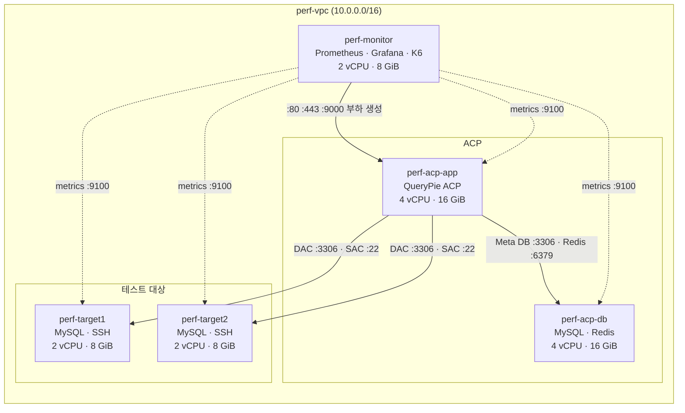

# AWS 성능 테스트 환경 구성 가이드

QueryPie DAC / SAC 성능 테스트를 위한 AWS 인프라 구성 방법을 안내합니다.
각 단계마다 **콘솔(웹 UI)** 방법과 **AWS CLI** 방법을 함께 제공합니다.

---

## 목차

1. [아키텍처 개요](#1-아키텍처-개요)
2. [사전 준비](#2-사전-준비)
3. [네트워크 구성](#3-네트워크-구성)
4. [보안 그룹 구성](#4-보안-그룹-구성)
5. [SSH 키페어 생성](#5-ssh-키페어-생성)
6. [EC2 인스턴스 생성](#6-ec2-인스턴스-생성)
7. [구성 정보 기록](#7-구성-정보-기록)
8. [구성 검증](#8-구성-검증)
9. [다음 단계](#9-다음-단계)

---

## 1. 아키텍처 개요

### VM 구성

| VM 이름 | 역할 | 권장 인스턴스 | vCPU | RAM | 스토리지 |
|---------|------|-------------|------|-----|---------|
| `perf-acp-app` | QueryPie ACP 서버 | m7i.xlarge | 4 | 16 GiB | 100 GiB gp3 |
| `perf-acp-db` | QueryPie ACP용 MySQL + Redis | m7i.xlarge | 4 | 16 GiB | 100 GiB gp3 |
| `perf-monitor` | Prometheus + Grafana + K6 | m7i.large | 2 | 8 GiB | 50 GiB gp3 |
| `perf-target1` | 테스트 대상 MySQL DB + SSH 서버 | m7i.large | 2 | 8 GiB | 50 GiB gp3 |
| `perf-target2` | 테스트 대상 MySQL DB + SSH 서버 | m7i.large | 2 | 8 GiB | 50 GiB gp3 |

> **인스턴스 타입 선택 기준**: 성능 테스트 중에는 K6 부하 생성, MySQL 연결 수신 등 지속적인 고부하가 발생합니다.
> `t3` 계열은 버스터블 인스턴스로 CPU credit 고갈 시 기준 성능(약 40%)으로 제한되어 테스트 결과가 왜곡될 수 있습니다.
> `m7i` 계열은 CPU를 항상 100% 보장하며 Intel Sapphire Rapids(2023) 기반 x86 아키텍처입니다.

> **node_exporter**: 시스템 지표 수집을 위해 모든 VM에 설치합니다. 설치 방법은 소프트웨어 설치 가이드를 참고하세요.

> `perf-target1`, `perf-target2`는 DAC 테스트용 MySQL과 SAC 테스트용 SSH 서버를 겸합니다.

### 데이터 흐름



### 주요 통신 포트

| 출발 | 목적지 | 포트 | 설명 |
|------|--------|------|------|
| K6 (`perf-monitor`) | `perf-acp-app` | 80, 443 | QueryPie API 호출 |
| K6 (`perf-monitor`) | `perf-acp-app` | 9000 | SAC 프록시 연결 |
| `perf-acp-app` | `perf-acp-db` | 3306 | QueryPie Meta DB |
| `perf-acp-app` | `perf-acp-db` | 6379 | QueryPie Redis |
| `perf-acp-app` | `perf-target1/2` | 3306 | DAC: DB 쿼리 프록시 |
| `perf-acp-app` | `perf-target1/2` | 22 | SAC: SSH 프록시 |
| Prometheus (`perf-monitor`) | 모든 VM | 9100 | node_exporter 메트릭 수집 |
| K6 (`perf-monitor`) | Prometheus | 9090 | K6 메트릭 remote write |
| 테스트 수행자 | `perf-monitor` | 3000 | Grafana 대시보드 |
| 테스트 수행자 | `perf-acp-app` | 80, 443 | QueryPie 관리 콘솔 |
| 테스트 수행자 | 모든 VM | 22 | 관리자 SSH |

---

## 2. 사전 준비

### AWS 계정 및 권한

- AWS 계정 준비
- 다음 권한이 있는 IAM User 또는 Role 필요:
  - `AmazonEC2FullAccess`
  - `AmazonVPCFullAccess`

### 콘솔 방법 사전 준비

- 웹 브라우저에서 [AWS 콘솔](https://console.aws.amazon.com) 로그인
- 우측 상단 리전을 **사용하려는 리전**으로 변경 (예: 아시아 태평양(서울) `ap-northeast-2`)

### CLI 방법 사전 준비

**AWS CLI 설치 확인**

```bash
aws --version
# 출력 예시: aws-cli/2.x.x Python/3.x.x ...
```

설치가 되어 있지 않다면 [AWS CLI 설치 가이드](https://docs.aws.amazon.com/cli/latest/userguide/install-cliv2.html)를 참고하세요.

**AWS CLI 인증 설정**

```bash
aws configure
# AWS Access Key ID: <IAM 사용자의 Access Key>
# AWS Secret Access Key: <IAM 사용자의 Secret Key>
# Default region name: <사용하려는 리전, 예: ap-northeast-2>
# Default output format: json
```

**CLI 공통 환경 변수 설정** (이후 모든 CLI 명령에서 사용)

```bash
export AWS_REGION=<사용하려는 리전>  # 예: ap-northeast-2, us-east-1, eu-west-1
```

**설정 확인**

```bash
aws sts get-caller-identity
# Account, UserId, Arn 이 출력되면 정상
```

---

## 3. 네트워크 선택

### 네트워크 구성 요건

성능 테스트 VM을 배치하려면 아래 조건을 갖춘 AWS VPC와 서브넷이 필요합니다.

| 항목 | 요건 |
|------|------|
| VPC | 모든 VM이 동일 VPC 내에 위치해야 함 (내부 Private IP 통신) |
| 서브넷 | 퍼블릭 서브넷 (인터넷 게이트웨이로의 `0.0.0.0/0` 경로 존재) |
| 퍼블릭 IP | 서브넷에 퍼블릭 IP 자동 할당(Auto-assign public IP) 활성화 |
| AZ | 단일 가용 영역 권장 (VM 간 지연 최소화) |

> **VPC/서브넷이 없는 경우**: [AWS 네트워크 구성 가이드](aws-network.ko.md)를 먼저 완료하세요.
> VPC, 서브넷, 인터넷 게이트웨이, 라우팅 테이블 생성 방법을 안내합니다.

### 사용할 VPC / 서브넷 확인

#### 콘솔 방법

1. VPC 콘솔 → **Subnets** 이동
2. 사용할 서브넷의 **Subnet ID**, **VPC ID** 메모
3. 서브넷 선택 → **Route table** 탭에서 `0.0.0.0/0 → igw-xxx` 경로 확인

#### CLI 방법

```bash
# 사용 가능한 퍼블릭 서브넷 목록 조회
aws ec2 describe-subnets \
  --region $AWS_REGION \
  --filters "Name=map-public-ip-on-launch,Values=true" \
  --query 'Subnets[*].[SubnetId,VpcId,CidrBlock,AvailabilityZone]' \
  --output table

# 사용할 VPC/Subnet ID를 환경 변수에 설정 (실제 값으로 변경)
export VPC_ID=vpc-xxxxxxxxxx
export SUBNET_ID=subnet-xxxxxxxxx
```

---

## 4. 보안 그룹 구성

모든 VM에 공통으로 적용할 보안 그룹 1개(`perf-sg`)를 생성합니다.

| Protocol | Port | Source | 설명 |
|----------|------|--------|------|
| TCP | 22 | 내 IP | 관리자 SSH |
| TCP | 80 | `0.0.0.0/0` | QueryPie Web UI |
| TCP | 443 | `0.0.0.0/0` | QueryPie Web UI (TLS) |
| TCP | 3000 | `0.0.0.0/0` | Grafana 대시보드 |
| All TCP | 0–65535 | `VPC CIDR` | VPC 내부 TCP 전체 허용 |
| ICMP | All | `VPC CIDR` | VPC 내부 ping 허용 |

VPC 내부 전체 허용으로 MySQL(3306), Redis(6379), SSH(22), Prometheus(9090), node_exporter(9100), SAC 프록시(9000) 등 모든 내부 통신이 자동으로 포함됩니다.

#### 콘솔 방법

1. VPC 콘솔 → **Security Groups** → **Create security group** 클릭
2. 아래와 같이 입력:
   - **Security group name**: `perf-sg`
   - **Description**: `Performance testing - all VMs`
   - **VPC**: 사용할 VPC 선택
3. **Inbound rules** → **Add rule** 로 위 표의 규칙 추가
   - VPC 내부 TCP 규칙: Type `All TCP`, Source를 VPC CIDR (예: `10.0.0.0/16`) 로 입력
   - VPC 내부 ICMP 규칙: Type `All ICMP - IPv4`, Source를 VPC CIDR 로 입력
4. **Create security group** 클릭
5. 생성된 **Security Group ID** 메모

#### CLI 방법

```bash
# 내 공인 IP 확인
MY_IP=$(curl -s https://checkip.amazonaws.com)

# VPC CIDR 자동 조회
VPC_CIDR=$(aws ec2 describe-vpcs \
  --vpc-ids $VPC_ID \
  --region $AWS_REGION \
  --query 'Vpcs[0].CidrBlock' \
  --output text)

SG_ID=$(aws ec2 create-security-group \
  --group-name "perf-sg" \
  --description "Performance testing - all VMs" \
  --vpc-id $VPC_ID \
  --tag-specifications "ResourceType=security-group,Tags=[{Key=Name,Value=perf-sg}]" \
  --region $AWS_REGION \
  --query 'GroupId' \
  --output text)

echo "Security Group ID: $SG_ID"

aws ec2 authorize-security-group-ingress \
  --group-id $SG_ID \
  --region $AWS_REGION \
  --ip-permissions \
    "IpProtocol=tcp,FromPort=22,ToPort=22,IpRanges=[{CidrIp=${MY_IP}/32,Description='Admin SSH'}]" \
    "IpProtocol=tcp,FromPort=80,ToPort=80,IpRanges=[{CidrIp=0.0.0.0/0,Description='QueryPie HTTP'}]" \
    "IpProtocol=tcp,FromPort=443,ToPort=443,IpRanges=[{CidrIp=0.0.0.0/0,Description='QueryPie HTTPS'}]" \
    "IpProtocol=tcp,FromPort=3000,ToPort=3000,IpRanges=[{CidrIp=0.0.0.0/0,Description='Grafana'}]" \
    "IpProtocol=tcp,FromPort=0,ToPort=65535,IpRanges=[{CidrIp=${VPC_CIDR},Description='VPC internal all TCP'}]" \
    "IpProtocol=icmp,FromPort=-1,ToPort=-1,IpRanges=[{CidrIp=${VPC_CIDR},Description='VPC internal ICMP'}]"
```

---

## 5. SSH 키페어 생성

모든 VM 접속에 사용할 SSH 키페어를 생성합니다.

#### 콘솔 방법

1. EC2 콘솔 → **Network & Security** → **Key Pairs** → **Create key pair** 클릭
2. 아래와 같이 입력:
   - **Name**: `perf-key`
   - **Key pair type**: `RSA`
   - **Private key file format**: `.pem`
3. **Create key pair** 클릭 → `.pem` 파일 자동 다운로드
4. 파일 이동 및 권한 설정:
   ```bash
   mv ~/Downloads/perf-key.pem ~/.ssh/
   chmod 400 ~/.ssh/perf-key.pem
   ```

#### CLI 방법

```bash
aws ec2 create-key-pair \
  --key-name "perf-key" \
  --key-type rsa \
  --query 'KeyMaterial' \
  --output text \
  --region $AWS_REGION > ~/.ssh/perf-key.pem

chmod 400 ~/.ssh/perf-key.pem
echo "키페어 저장 완료: ~/.ssh/perf-key.pem"
```

---

## 6. EC2 인스턴스 생성

### Amazon Linux 2023 AMI ID 확인

#### CLI 방법

```bash
AL2023_AMI=$(aws ec2 describe-images \
  --owners amazon \
  --filters \
    "Name=name,Values=al2023-ami-2023*-x86_64" \
    "Name=state,Values=available" \
  --query 'sort_by(Images, &CreationDate)[-1].ImageId' \
  --output text \
  --region $AWS_REGION)

echo "Amazon Linux 2023 AMI: $AL2023_AMI"
```

#### 콘솔 방법

EC2 콘솔 → **Launch Instance** → **Quick Start** 탭 → `Amazon Linux 2023 AMI` 선택 후 AMI ID 확인

---

### 6.1 perf-acp-app

QueryPie ACP 서버가 작동하는 VM입니다.

#### 콘솔 방법

1. EC2 콘솔 → **Launch Instances** 클릭
2. 아래와 같이 설정:
   - **Name**: `perf-acp-app`
   - **AMI**: `Amazon Linux 2023 AMI`
   - **Instance type**: `m7i.xlarge`
   - **Key pair**: `perf-key`
   - **VPC**: `perf-vpc`, **Subnet**: `perf-subnet`
   - **Auto-assign public IP**: `Enable`
   - **Security group**: `perf-sg`
   - **Storage**: `100 GiB, gp3`
3. **Launch Instance** 클릭

#### CLI 방법

```bash
ACP_APP_ID=$(aws ec2 run-instances \
  --image-id $AL2023_AMI \
  --instance-type m7i.xlarge \
  --key-name "perf-key" \
  --security-group-ids $SG_ID \
  --subnet-id $SUBNET_ID \
  --associate-public-ip-address \
  --block-device-mappings 'DeviceName=/dev/sda1,Ebs={VolumeSize=100,VolumeType=gp3,DeleteOnTermination=true}' \
  --tag-specifications "ResourceType=instance,Tags=[{Key=Name,Value=perf-acp-app}]" \
  --region $AWS_REGION \
  --query 'Instances[0].InstanceId' \
  --output text)

echo "perf-acp-app: $ACP_APP_ID"
```

---

### 6.2 perf-acp-db

QueryPie ACP 전용 MySQL, Redis가 작동하는 VM입니다.

#### 콘솔 방법

1. **Launch Instances** 클릭
2. 아래와 같이 설정:
   - **Name**: `perf-acp-db`
   - **Instance type**: `m7i.xlarge`
   - **Security group**: `perf-sg`
   - **Storage**: `100 GiB, gp3`
   - 나머지는 perf-acp-app과 동일

#### CLI 방법

```bash
ACP_DB_ID=$(aws ec2 run-instances \
  --image-id $AL2023_AMI \
  --instance-type m7i.xlarge \
  --key-name "perf-key" \
  --security-group-ids $SG_ID \
  --subnet-id $SUBNET_ID \
  --associate-public-ip-address \
  --block-device-mappings 'DeviceName=/dev/sda1,Ebs={VolumeSize=100,VolumeType=gp3,DeleteOnTermination=true}' \
  --tag-specifications "ResourceType=instance,Tags=[{Key=Name,Value=perf-acp-db}]" \
  --region $AWS_REGION \
  --query 'Instances[0].InstanceId' \
  --output text)

echo "perf-acp-db: $ACP_DB_ID"
```

---

### 6.3 perf-monitor

Prometheus, Grafana, K6가 작동하는 VM입니다.

#### 콘솔 방법

1. **Launch Instances** 클릭
2. 아래와 같이 설정:
   - **Name**: `perf-monitor`
   - **Instance type**: `m7i.large`
   - **Security group**: `perf-sg`
   - **Storage**: `50 GiB, gp3`
   - 나머지는 perf-acp-app과 동일

#### CLI 방법

```bash
MONITOR_ID=$(aws ec2 run-instances \
  --image-id $AL2023_AMI \
  --instance-type m7i.large \
  --key-name "perf-key" \
  --security-group-ids $SG_ID \
  --subnet-id $SUBNET_ID \
  --associate-public-ip-address \
  --block-device-mappings 'DeviceName=/dev/sda1,Ebs={VolumeSize=50,VolumeType=gp3,DeleteOnTermination=true}' \
  --tag-specifications "ResourceType=instance,Tags=[{Key=Name,Value=perf-monitor}]" \
  --region $AWS_REGION \
  --query 'Instances[0].InstanceId' \
  --output text)

echo "perf-monitor: $MONITOR_ID"
```

---

### 6.4 perf-target1, perf-target2

DAC(MySQL) 및 SAC(SSH) 테스트 대상 서버입니다.

#### 콘솔 방법

아래 설정으로 인스턴스를 **2회 반복** 생성하거나, **Number of instances를 2**로 설정합니다.

1. **Launch Instances** 클릭
2. 아래와 같이 설정:
   - **Name**: `perf-target1` (두 번째는 `perf-target2`)
   - **AMI**: `Amazon Linux 2023 AMI`
   - **Instance type**: `m7i.large`
   - **Key pair**: `perf-key`
   - **VPC**: `perf-vpc`, **Subnet**: `perf-subnet`
   - **Auto-assign public IP**: `Enable`
   - **Security group**: `perf-sg`
   - **Storage**: `50 GiB, gp3`

> 콘솔에서 **Number of instances: 2**로 생성 후, 각각 이름을 `perf-target1`, `perf-target2`로 변경하는 것이 편리합니다.

#### CLI 방법

```bash
TARGET1_ID=$(aws ec2 run-instances \
  --image-id $AL2023_AMI \
  --instance-type m7i.large \
  --key-name "perf-key" \
  --security-group-ids $SG_ID \
  --subnet-id $SUBNET_ID \
  --associate-public-ip-address \
  --block-device-mappings 'DeviceName=/dev/sda1,Ebs={VolumeSize=50,VolumeType=gp3,DeleteOnTermination=true}' \
  --tag-specifications "ResourceType=instance,Tags=[{Key=Name,Value=perf-target1}]" \
  --region $AWS_REGION \
  --query 'Instances[0].InstanceId' \
  --output text)

TARGET2_ID=$(aws ec2 run-instances \
  --image-id $AL2023_AMI \
  --instance-type m7i.large \
  --key-name "perf-key" \
  --security-group-ids $SG_ID \
  --subnet-id $SUBNET_ID \
  --associate-public-ip-address \
  --block-device-mappings 'DeviceName=/dev/sda1,Ebs={VolumeSize=50,VolumeType=gp3,DeleteOnTermination=true}' \
  --tag-specifications "ResourceType=instance,Tags=[{Key=Name,Value=perf-target2}]" \
  --region $AWS_REGION \
  --query 'Instances[0].InstanceId' \
  --output text)

echo "perf-target1: $TARGET1_ID"
echo "perf-target2: $TARGET2_ID"
```

---

### 6.5 인스턴스 시작 대기

#### CLI 방법

```bash
ALL_IDS="$ACP_APP_ID $ACP_DB_ID $MONITOR_ID $TARGET1_ID $TARGET2_ID"

echo "인스턴스 시작 대기 중..."
aws ec2 wait instance-running \
  --instance-ids $ALL_IDS \
  --region $AWS_REGION

echo "모든 인스턴스가 실행 중입니다."
```

---

## 7. 구성 정보 기록

생성된 인스턴스의 IP 주소를 수집합니다. `prometheus.yml` 설정 시 필요합니다.

#### CLI 방법

```bash
get_ip() {
  local instance_id=$1
  local type=$2  # PublicIpAddress 또는 PrivateIpAddress
  aws ec2 describe-instances \
    --instance-ids $instance_id \
    --region $AWS_REGION \
    --query "Reservations[0].Instances[0].${type}" \
    --output text
}

echo "=== VM 구성 정보 ==="
printf "%-20s %-18s %-18s\n" "VM 이름" "Public IP" "Private IP"
printf "%-20s %-18s %-18s\n" "--------" "---------" "----------"
printf "%-20s %-18s %-18s\n" "perf-acp-app"  "$(get_ip $ACP_APP_ID  PublicIpAddress)" "$(get_ip $ACP_APP_ID  PrivateIpAddress)"
printf "%-20s %-18s %-18s\n" "perf-acp-db"   "$(get_ip $ACP_DB_ID   PublicIpAddress)" "$(get_ip $ACP_DB_ID   PrivateIpAddress)"
printf "%-20s %-18s %-18s\n" "perf-monitor"  "$(get_ip $MONITOR_ID  PublicIpAddress)" "$(get_ip $MONITOR_ID  PrivateIpAddress)"
printf "%-20s %-18s %-18s\n" "perf-target1"  "$(get_ip $TARGET1_ID  PublicIpAddress)" "$(get_ip $TARGET1_ID  PrivateIpAddress)"
printf "%-20s %-18s %-18s\n" "perf-target2"  "$(get_ip $TARGET2_ID  PublicIpAddress)" "$(get_ip $TARGET2_ID  PrivateIpAddress)"
```

#### 콘솔 방법

EC2 콘솔 → **Instances** 목록에서 각 인스턴스의 **Public IPv4** 및 **Private IPv4** 확인 후 아래 표에 기록:

| VM 이름 | Public IP | Private IP |
|---------|-----------|------------|
| perf-acp-app | | |
| perf-acp-db | | |
| perf-monitor | | |
| perf-target1 | | |
| perf-target2 | | |

> 수집한 Private IP는 `prometheus/etc/prometheus/prometheus.yml`의 `node-exporters` 섹션에 입력합니다.

---

## 8. 구성 검증

### 8.1 인스턴스 상태 확인

#### CLI 방법

```bash
aws ec2 describe-instances \
  --instance-ids $ALL_IDS \
  --region $AWS_REGION \
  --query 'Reservations[*].Instances[*].[Tags[?Key==`Name`].Value|[0],State.Name,PublicIpAddress,PrivateIpAddress]' \
  --output table
```

모든 인스턴스의 State가 `running`인지 확인합니다.

### 8.2 SSH 접속 확인

```bash
ACP_APP_PUBLIC=<perf-acp-app의 Public IP>

ssh -i ~/.ssh/perf-key.pem ec2-user@${ACP_APP_PUBLIC} "uname -a && free -h && df -h"
```

정상적으로 출력되면 SSH 키페어 및 보안 그룹 설정이 올바른 것입니다.

### 8.3 VM 간 내부 통신 확인

perf-acp-app에서 다른 VM의 Private IP로 통신이 되는지 확인합니다.

```bash
ACP_DB_PRIVATE=<perf-acp-db의 Private IP>

ssh -i ~/.ssh/perf-key.pem ec2-user@${ACP_APP_PUBLIC} "ping -c 3 ${ACP_DB_PRIVATE}"
```

---

## 9. 다음 단계

인프라 구성이 완료되었습니다.

1. **소프트웨어 설치**: 각 VM에 Docker 설치 후 역할별 컨테이너 실행
   - `perf-acp-app`: QueryPie ACP
   - `perf-acp-db`: MySQL, Redis
   - `perf-monitor`: Prometheus, Grafana
   - `perf-target1/2`: MySQL, openssh-server
2. **모니터링 설정**: `prometheus.yml`에 수집한 Private IP 입력
3. **QueryPie ACP 초기 설정**: 서버 그룹, 롤, 정책, External API 토큰 발급
4. **성능 테스트 실행**: `k6-run/` 셸 스크립트 실행

---

## 부록: 환경 정리 (테스트 완료 후)

```bash
# 인스턴스 종료
aws ec2 terminate-instances \
  --instance-ids $ACP_APP_ID $ACP_DB_ID $MONITOR_ID $TARGET1_ID $TARGET2_ID \
  --region $AWS_REGION

# 인터넷 게이트웨이 분리 및 삭제
aws ec2 detach-internet-gateway --internet-gateway-id $IGW_ID --vpc-id $VPC_ID --region $AWS_REGION
aws ec2 delete-internet-gateway --internet-gateway-id $IGW_ID --region $AWS_REGION

# 서브넷 삭제
aws ec2 delete-subnet --subnet-id $SUBNET_ID --region $AWS_REGION

# 보안 그룹 삭제
aws ec2 delete-security-group --group-id $SG_ID --region $AWS_REGION

# VPC 삭제
aws ec2 delete-vpc --vpc-id $VPC_ID --region $AWS_REGION

echo "환경 정리 완료"
```
